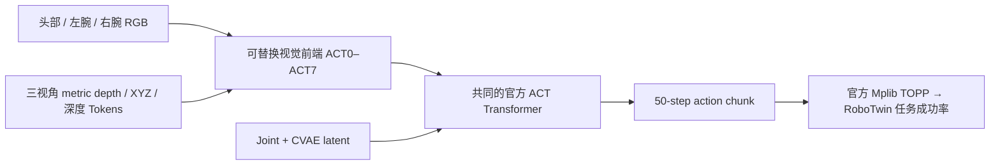
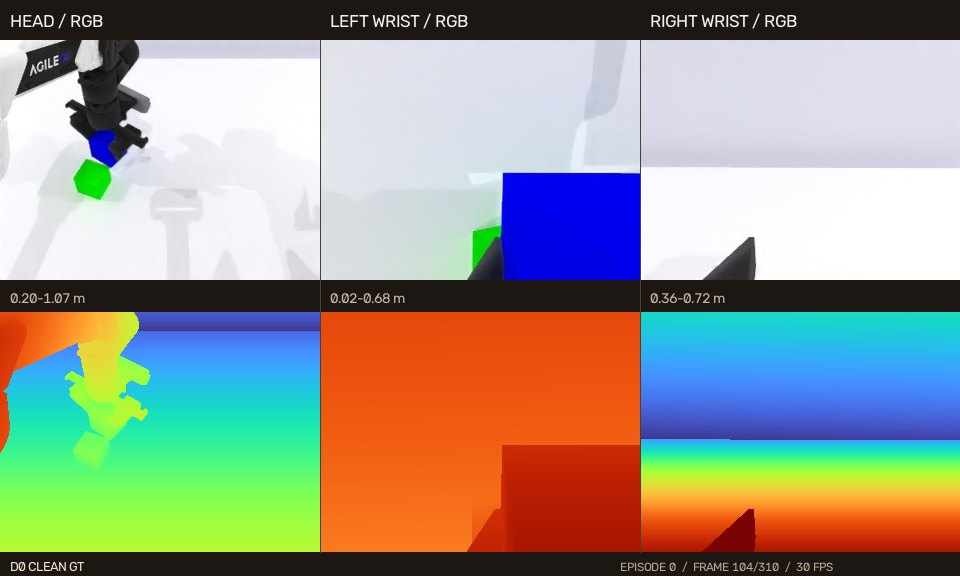
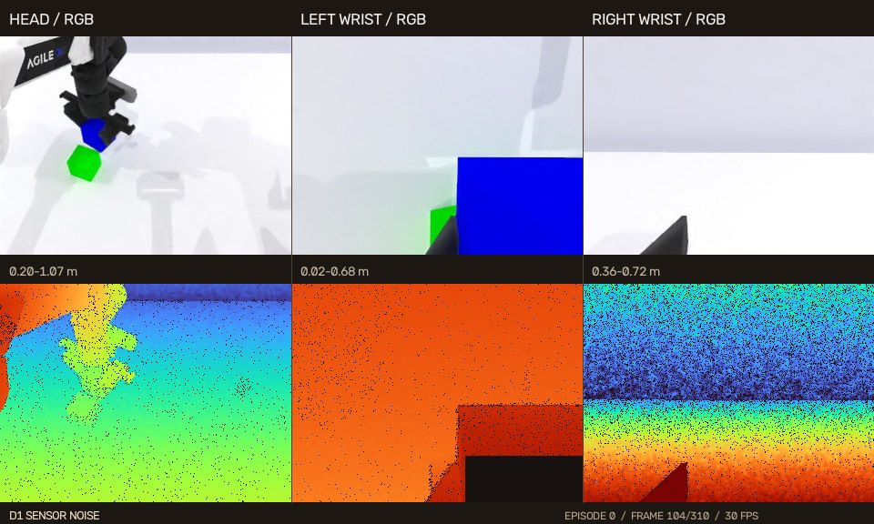
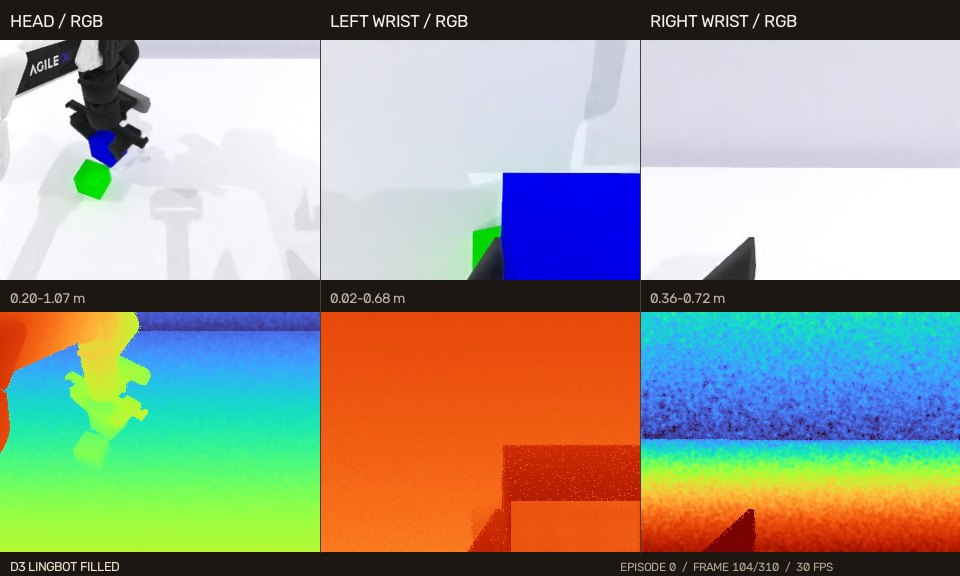
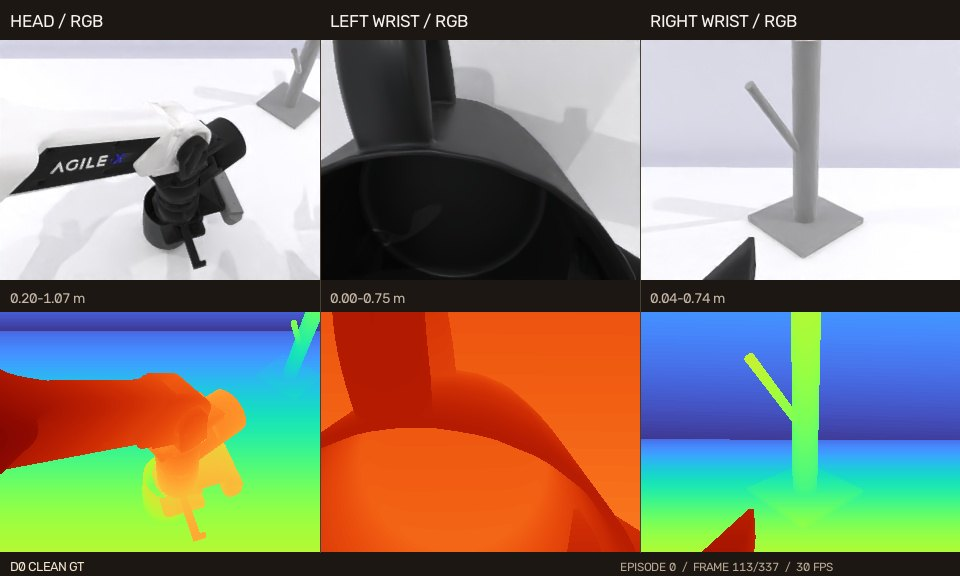
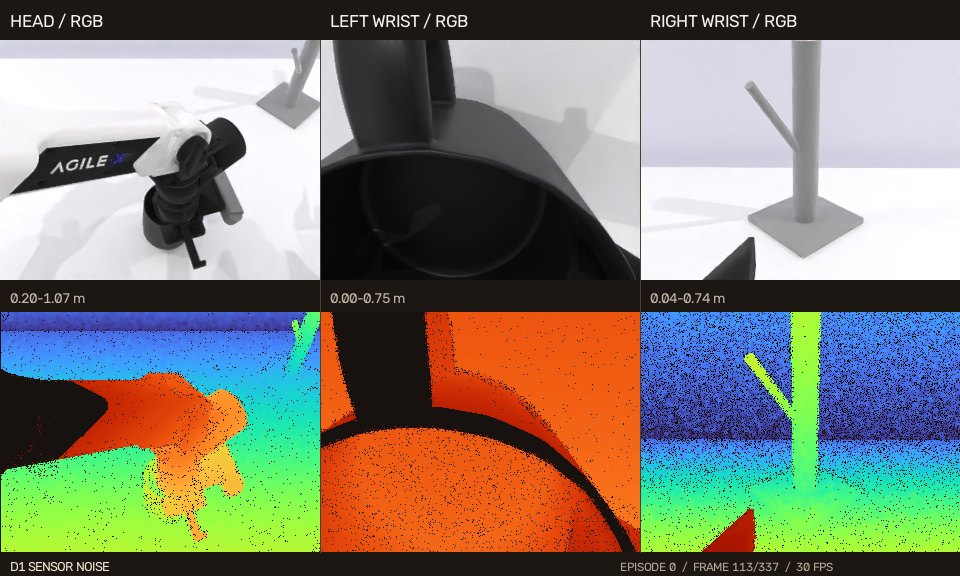
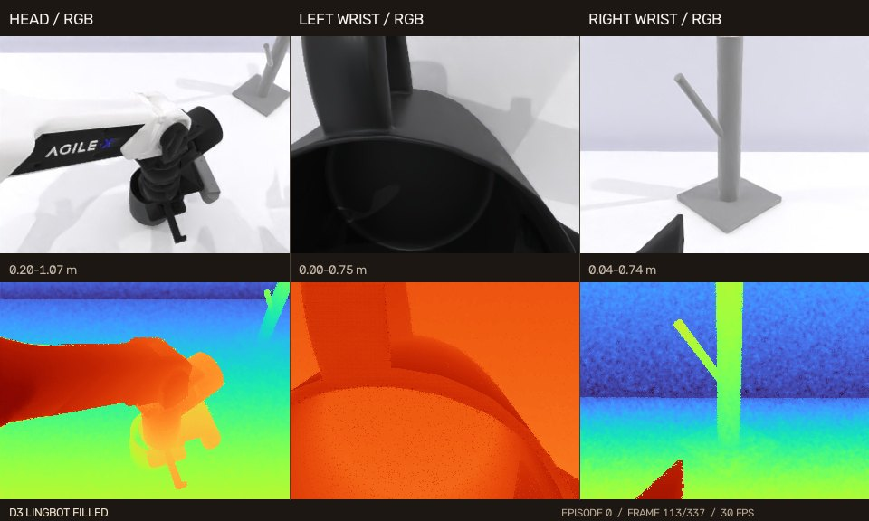

# Depth Process Model

**三视角 RGB-D 机器人策略的深度输入架构探索与深度修复评测。**

本项目围绕两个问题展开：机器人策略如何编码和融合深度信息，以及传感器深度经过修复后，
是否能改善实际任务成功率。实验从官方 RoboTwin ACT 出发，扩展到 π0.5，并结合真实 RGB-D
数据的几何质量、动作误差和可视化证据分析处理效果。

- **亮点一：不同深度输入模型架构的探索。** 在共同的官方 ACT 动作核心上比较四通道早期融合、
  共享/逐视角双流 ResNet、XYZ 点图、Point Tokens、LingBot-Depth Tokens 和 Depth Transformer，
  再将逐视角深度分支迁移到 π0.5。
- **亮点二：深度图修复与部署效果验证。** 从干净 GT Depth 构造 RealSense 模拟噪声，使用
  LingBot-Depth 补全孔洞，并通过训练深度 × 部署深度矩阵检验修复效果；同时提供真机深度质量证据。

[完整部署结果与评测记录](docs/DEPLOYMENT_RESULTS_README.md) ·
[双任务 D0/D1/D3 训练 RGB-D 视频](https://expolrer.github.io/depth-process-model/robotwin/) ·
[ACT 架构定义](robotwin-official-act-rgbd/ARCHITECTURE_ZH.md) ·
[ACT 代码与训练入口](robotwin-official-act-rgbd/README.md) ·
[RGB-D 交互展示](https://expolrer.github.io/depth-process/)

## 1. 深度输入模型架构探索

### 官方 ACT 上的八种视觉前端

ACT0 是三视角 RGB + joint 的官方 ACT 基线。ACT1–ACT7 在相同动作核心中增加不同深度表示：
保持 action CVAE、Transformer encoder/decoder、action queries、动作头与官方 Mplib TOPP
执行方式作为共同条件，比较视觉编码和融合方式。



以下八种架构均使用各任务的 D0 数据训练至 **6000 epochs**，部署为 D0；ACT0 只读取 RGB。
同一任务内使用共同的 100 个有效评测种子，两个任务分别训练各自的权重。

| 架构 | 深度表示与融合方式 | `stack_blocks_two` 常规 | `hanging_mug` Easy |
| --- | --- | ---: | ---: |
| `ACT0_RGB` | 三视角共享 RGB ResNet18 + joint；RGB-only 基线 | 18% | 8% |
| `ACT1_EARLY_RGBD` | 每视角 RGB + 单通道 metric depth，共享四通道 ResNet18 | 23% | **16%** |
| `ACT2_DUAL_SHARED` | 共享 RGB ResNet18 + 共享 Depth ResNet18，Token 级后融合 | 7% | 10% |
| `ACT3_DUAL_PER_VIEW` | 3 个 RGB + 3 个 Depth ResNet18，逐视角双流融合 | **31%** | 10% |
| `ACT4_XYZMAP` | RGB ResNet18 + 深度反投影的相机坐标 XYZ 点图 | 20% | 7% |
| `ACT5_POINT_TOKENS` | RGB ResNet18 + 深度反投影的 XYZ Point Tokens | 20% | 6% |
| `ACT6_LINGBOT_DEPTH` | RGB ResNet18 + 冻结 LingBot-Depth v0.5 Tokens | 11% | 3% |
| `ACT7_DEPTH_TRANSFORMER` | RGB ResNet18 + Depth Transformer Tokens | 16% | 11% |

在这轮实验中，`stack_blocks_two` 的最高 ACT 成功率由 RGB 基线的 **18%** 提升到逐视角双流的
**31%**，相差 **13 个百分点**；`hanging_mug` 的最高 ACT 成功率由 **8%** 提升到四通道早期融合的
**16%**，相差 **8 个百分点**。两个任务的最优前端不同，说明深度表示与任务几何之间存在关联，
增加更复杂的深度编码器也未必获得更高成功率。

ACT3 的 `hanging_mug` 成绩来自新训练的 2-worker D0 权重。各架构参数量不同，当前结果反映
相同训练 epoch 预算下的系统表现；单次训练与 100 轮评测尚不足以证明统计显著性。
ACT7 改变的是深度编码器，动作生成器仍为 ACT Transformer。

### 逐视角深度分支迁移到 VLA

| 模型 | 输入与架构 | 训练预算 | `stack_blocks_two` 常规 | `hanging_mug` Easy |
| --- | --- | ---: | ---: | ---: |
| 官方 π0.5 JAX | 三视角 RGB + joint + prompt，全参微调 | 20000 steps | 63% | 21% |
| `PI05_RGBD4` | π0.5 + 每视角 RGB-D 四通道早期融合；D0 训练、D0 部署 | 20000 steps | 未评测 | 25% |
| `PI05_DUAL_PER_VIEW` | π0.5 + 三个独立 Depth ResNet18；D0 训练、D0 部署 | 20000 steps | 66% | 28% |
| LingBot-VLA 2.0 | Qwen3-VL-4B + MoE Action Expert；RGB + joint + prompt | 30000 steps | 65% | 未评测 |

`PI05_DUAL_PER_VIEW` 是显式深度输入方案；LingBot-VLA 2.0 在本次实验中使用 MoGe、LingBot-Depth
和 DINO-Video 提供训练期几何/时序蒸馏监督，部署时不直接读取 RoboTwin GT Depth。
官方 π0.5 与深度版 π0.5 的场景配置存在差异，66% 与 63% 的差值只作描述性比较。

## 2. 深度图修复与跨环境部署

### 干净、受损、修复三种深度输入

| 深度环境 | 定义 | 实验用途 |
| --- | --- | --- |
| `D0` | 干净 GT metric depth | 深度输入架构筛选与理想几何基准 |
| `D1` | 确定性的 RealSense D435/D405 模拟噪声深度 | 传感器退化与部署鲁棒性 |
| `D3` | 保留 D1 有效像素，仅用 LingBot-Depth v0.5 填补 D1 空洞 | 传感器保真修复 |

固定模型架构，分别用 D0、D1、D3 训练，再在 D0、D1、D3 部署，形成 3 × 3 矩阵。
这能同时观察“训练时使用修复深度”和“部署时修复受损深度”的效果。
D3 重叠区保留传感器数值，不意味着孔洞补全值具有零误差。

**当前修复效果具有条件性。** `stack_blocks_two` Randomized 中，D0 训练的深度版 π0.5 从
D1 部署的 **18%** 到 D3 部署的 **24%**；`hanging_mug` Easy 中，同类 D0 训练权重从 **34%**
下降到 **26%**。四通道 π0.5 在 `hanging_mug` Easy 的 D1→D3 部署则从 **27%** 降到 **23%**。
因此首页展示完整矩阵，结合任务、架构和训练输入分析增益与下降。
`stack_blocks_two` Randomized 的跨格种子集合不保证完全相同，差值仅作描述性比较。

<details open>
<summary><strong>stack_blocks_two 常规场景：ACT 与 π0.5</strong></summary>

| 模型架构 | 训练深度环境 | 部署 D0 | 部署 D1 | 部署 D3 |
| --- | --- | ---: | ---: | ---: |
| `ACT3_DUAL_PER_VIEW` | D0 clean GT | 31% | 26% | 33% |
| `ACT3_DUAL_PER_VIEW` | D1 RealSense noise | 16% | 24% | 16% |
| `ACT3_DUAL_PER_VIEW` | D3 LingBot sensor-fused | 19% | 12% | 20% |
| 官方 π0.5 JAX | RGB-only | 63% | 63% | 63% |
| `PI05_DUAL_PER_VIEW` | D0 clean GT | 66% | 57% | 56% |
| `PI05_DUAL_PER_VIEW` | D1 RealSense noise | 55% | 60% | 58% |
| `PI05_DUAL_PER_VIEW` | D3 LingBot sensor-fused | 59% | 61% | 64% |

ACT3 与深度版 π0.5 的各自矩阵使用 `100000–100099` 共 100 个有效种子。
官方 π0.5 JAX 仅独立评测 RGB-only 的 63/100，D1/D3 列复用这一成绩。

</details>

<details>
<summary><strong>stack_blocks_two Randomized：ACT 与 π0.5</strong></summary>

| 模型架构 | 训练深度环境 | 部署 D0 | 部署 D1 | 部署 D3 |
| --- | --- | ---: | ---: | ---: |
| `ACT0–ACT7` | D0/D1/D3；ACT0 为 RGB-only | 0% | 0% | 0% |
| 官方 π0.5 JAX | RGB-only | 21% | 21% | 21% |
| `PI05_DUAL_PER_VIEW` | D0 clean GT | 15% | 18% | 24% |
| `PI05_DUAL_PER_VIEW` | D1 RealSense noise | 16% | 18% | 15% |
| `PI05_DUAL_PER_VIEW` | D3 LingBot sensor-fused | 17% | 21% | 24% |

场景配置为 `demo_randomized_depth_20260924`。π0.5 每格完成 100 个 expert-valid episodes，
有效性筛选后的种子集合不保证跨格相同。官方 JAX 的 D1/D3 列复用 RGB-only 的 21/100。
ACT 汇总行沿用部署结果文档中确认的正式结论，逐项权重组合未在该行展开。

</details>

<details open>
<summary><strong>hanging_mug Easy：ACT 与 π0.5</strong></summary>

| 模型架构 | 训练深度环境 | 部署 D0 | 部署 D1 | 部署 D3 |
| --- | --- | ---: | ---: | ---: |
| `ACT1_EARLY_RGBD` | D0 clean GT | 16% | 未评测 | 未评测 |
| `ACT1_EARLY_RGBD` | D1 RealSense noise | 15% | 10% | 11% |
| `ACT1_EARLY_RGBD` | D3 LingBot sensor-fused | 13% | 13% | 13% |
| `ACT3_DUAL_PER_VIEW` | D0 clean GT | 10% | 10% | 12% |
| `ACT3_DUAL_PER_VIEW` | D1 RealSense noise | 0% | 4% | 0% |
| `ACT3_DUAL_PER_VIEW` | D3 LingBot sensor-fused | 6% | 13% | 6% |
| 官方 π0.5 JAX | RGB-only | 21% | 21%* | 21%* |
| `PI05_RGBD4` | D0 clean GT | 25% | 27% | 23% |
| `PI05_DUAL_PER_VIEW` | D0 clean GT | 28% | 34% | 26% |
| `PI05_DUAL_PER_VIEW` | D1 RealSense noise | 27% | 22% | 23% |

场景配置为 `depth_master_clean`，完成单元共用同一批 100 个 held-out expert-valid seeds。
ACT3 D3→D3 已完成正式 100 轮。* 官方 π0.5 JAX 仅独立评测 RGB-only 的 D0 列，D1/D3 复用其成绩。

</details>

<details>
<summary><strong>hanging_mug Randomized：π0.5 与 ACT 实测状态</strong></summary>

| 模型架构 | 训练深度环境 | 部署 D0 | 部署 D1 | 部署 D3 |
| --- | --- | ---: | ---: | ---: |
| 官方 π0.5 JAX | RGB-only | 17% | 17%* | 17%* |
| `PI05_RGBD4` | D0 clean GT | 16% | 18% | 18% |
| `PI05_DUAL_PER_VIEW` | D0 clean GT | 18% | 18% | 16% |
| `PI05_DUAL_PER_VIEW` | D1 RealSense noise | 19% | 18% | 14% |

上述 π0.5 各实际评测单元共用同一批 100 个 expert-valid held-out seeds。
* 官方 π0.5 JAX 的 D1/D3 列复用 RGB-only 的 17/100，不是独立评测。
ACT0–ACT4 使用 D0 训练、D0 部署，实测均为 0/75，按预设规则提前停止并记 0%；
ACT5、ACT6、ACT7 分别为 0/70、0/29、0/43，已停止，尚无正式成功率。
这些提前停止或未完成记录不能写成实测 0/100。

</details>

### 评测口径与结果追溯

- 成功率按 RoboTwin 原始任务成功谓词计算，控制执行采用官方 Mplib TOPP。
- 指令划分为 `unseen`；每个正式完成单元为 100 轮，并校验逐 seed 计数与完成标记。
- `hanging_mug` Easy 的八种 ACT 共用 100 个 held-out 有效种子；两个任务的种子集合不同。
- `stack_blocks_two` 官方 RGB-only π0.5 使用 `demo_clean`，深度版使用 `demo_clean_depth`，
  ACT3 使用 `depth_master_clean`；跨模型比较应保留这些配置差异。
- 当前 D1/D3 正式成绩采用颜色顺序修正后的批次；无动作执行和旧 RGB/BGR 错配结果已排除。
- 结果来源为 [DEPLOYMENT_RESULTS_README.md](docs/DEPLOYMENT_RESULTS_README.md)，
  其中保存权重、种子 SHA256、批次路径、未完成状态与去重规则。

[颜色通道审计与修复范围](docs/EVAL_INPUT_COLOR_ORDER_AUDIT_20260926.md) ·
[ACT 历史执行计划](robotwin-official-act-rgbd/EXECUTION_PLAN_ZH.md) ·
[早期 FairACT 探索记录](docs/robotwin_benchmark/ROBOTWIN_BENCHMARK_STATUS.md)

## RoboTwin 训练 RGB-D 视频

[打开双任务交互视频与部署结果页面](https://expolrer.github.io/depth-process-model/robotwin/)

下方每个预览均来自**训练集 episode 0 的完整轨迹**，不是全部 50 条训练轨迹。两个任务分别
展示 D0 干净 GT、由同一 D0 派生的 D1 RealSense 模拟噪声、以及从 D1 修复得到的 D3。
每段视频上排为三视角 RGB，下排为对齐深度；同一任务同一视角的深度色标跨方法固定。
视频展示深度输入质量，不应直接解释为模型关注区域或任务成功率。成功率以本页正式结果表为准。

| 任务 | D0 干净 GT | D1 传感器噪声 | D3 LingBot 修复 |
| --- | --- | --- | --- |
| `stack_blocks_two` | [](https://expolrer.github.io/depth-process-model/robotwin/?scene=stack_blocks_two&method=d0) | [](https://expolrer.github.io/depth-process-model/robotwin/?scene=stack_blocks_two&method=d1) | [](https://expolrer.github.io/depth-process-model/robotwin/?scene=stack_blocks_two&method=d3) |
| `hanging_mug` | [](https://expolrer.github.io/depth-process-model/robotwin/?scene=hanging_mug&method=d0) | [](https://expolrer.github.io/depth-process-model/robotwin/?scene=hanging_mug&method=d1) | [](https://expolrer.github.io/depth-process-model/robotwin/?scene=hanging_mug&method=d3) |

六段视频均为 30 FPS、三相机对齐、H.264 MP4；每段的 SHA256、帧数、有效深度比例与源文件
记录在 [媒体清单](docs/robotwin/media/manifest.json)。可用
[`scripts/export_training_rgbd_videos.py`](scripts/export_training_rgbd_videos.py) 从主数据集与派生深度重建。

## RGB-D Depth Lab 在线展示

[打开完整交互页面](https://expolrer.github.io/depth-process/) ·
[深度处理对比](https://expolrer.github.io/depth-process/?view=depth) ·
[ACT 热力图对比](https://expolrer.github.io/depth-process/?view=attention) ·
[接触关键帧与批准 ROI](https://expolrer.github.io/depth-process/attention_review/) ·
[四类深度质量证据](https://expolrer.github.io/depth-process/quality_evidence/) ·
[RGB-D 数据增强审计](https://expolrer.github.io/depth-process/augmentation/)

[](https://expolrer.github.io/depth-process/?view=depth)

真实数据展示覆盖 5 个 ROS1 bag、三视角相机和 85 个完整同步视频，可切换 7 种深度处理方法，
并对比对应的无 Prompt ACT 热力图、动作误差和执行腕目标 ROI 指标。
下方真实 RGB-D 的离线几何质量与代理指标，与上方 RoboTwin 在线任务成功率分别报告。

## 真实 RGB-D 数据：离线质量与代理指标

全量深度统计覆盖 5 个数据集、15 路相机流、14,731 个 RGB-D 相机帧和
5,996,106,240 个像素。原始对齐深度有效率为 65.49%，深度中位数为 0.733 m，
P95 为 4.010 m。下游代理评测使用同一个无 Prompt、Depth-only ACT 检查点，
在 932 个留出帧上计算 14-DoF 动作块误差。

| 方法 | 有效覆盖率 | 新增填充率 | 传感器重叠 MAE | ACT chunk MAE | 相对原始 ACT | 执行腕 ROI lift |
| --- | ---: | ---: | ---: | ---: | ---: | ---: |
| 原始对齐深度 | 65.49% | 0.00% | 基准 | 0.1157 rad | 基线 | 1.085 |
| RGB 引导 | 67.20% | 1.71% | 2.16 cm | 0.1164 rad | 上升 0.62% | 1.086 |
| RGB + 时序 | 67.20% | 1.71% | 2.24 cm | 0.1164 rad | 上升 0.64% | 1.086 |
| LingBot-Depth v0.5 | 99.14% | 33.82% | 15.00 cm | **0.1123 rad** | **降低 2.90%** | 1.104 |
| Depth Anything V2 融合 | 89.44% | 23.94% | 0（保留） | 0.1151 rad | 降低 0.48% | 1.098 |
| LingBot 传感器融合 | **99.32%** | **33.82%** | 0（保留） | 0.1150 rad | 降低 0.59% | **1.105** |
| AI 双模型一致性融合 | 86.88% | 21.39% | 0（保留） | 0.1148 rad | 降低 0.78% | 1.095 |

`新增填充率` 是“原始无效、处理后有效”的像素占全部像素的比例。融合方法的
`0（保留）` 表示其直接复制原始有效传感器像素，因此重叠区误差按构造为 0；
它不代表孔洞填充值具有零误差。ACT 是离线下游代理评测，不等同于真机成功率。
全零深度和空间打乱深度的 ACT MAE 分别为 0.2562 和 0.2400 rad，明显劣于正常方法；
但全零深度的 ROI lift 仍可偏高，因此注意力集中度不能脱离动作误差和负对照单独排名。

首页指标数据同时保存为 `docs/data/depth_quality_metrics.json`，便于复核或二次分析。

### CDM 双腕 D405 实测

CDM 评估只覆盖 5 个数据集的 `cam_l` / `cam_r` 共 10 路 D405、9,824 帧，使用与模型输入一致的
`depth_aligned_rgb_mm` 和 0.07–0.50 m 有效量程。头部相机为 Gemini-335L，没有套用 D435 权重。

| 指标 | 原始对齐深度 | CDM D405 纯模型 | CDM D405 传感器融合 |
| --- | ---: | ---: | ---: |
| 全量有效覆盖率 | 29.39% | 84.79% | **84.86%** |
| 全量新增填充率 | 0 | 55.47% | **55.47%** |
| RGB-Depth 边缘 F1（采样） | 0.152 | **0.408** | 0.370 |
| 自然孔洞恢复覆盖率 | 0 | **99.37%** | **99.37%** |
| 恢复像素 5 cm 内正确率 | - | **90.69%** | **90.69%** |
| 任务 ROI 有效覆盖率 | 49.12% | 99.79% | **99.88%** |
| 传感器重叠区 MAE | 0（基准） | 1.69 cm | **0（保留）** |
| 主要平面 RMSE | **7.74 mm** | 8.94 mm | 9.02 mm |

这些结果说明 CDM 能显著补全 D405 孔洞并改善 RGB 边缘对齐；传感器融合版严格保留量程内的原始有效像素。
但补全后的平面代理误差略高于原始深度，不能仅凭覆盖率宣称几何质量全面提升。CDM 尚未进入 ACT/VLA
下游动作误差或成功率评测，首页对应单元明确显示“待评测”。完整报告位于
`docs/quality_evidence/cdm_d405/`。

## 四类无模型深度质量证据

最新评估覆盖 5 个数据集、15 路相机视图、180 帧空间质量样本、90 个时序片段和
410 帧人工批准任务 ROI。计算过程只使用 RGB、深度、时序对应关系和批准 ROI，
不调用注意力图或训练后的动作策略，因此可在不占用训练 GPU 的情况下复核：

| 证据 | 主要结果 | 解读边界 |
| --- | --- | --- |
| 无模型深度质量 | LingBot v0.5 的 RGB-Depth 边缘 F1 为 **0.437**，原始深度为 0.287；时序残差由 11.24 mm 降至 **3.72 mm** | 平滑度降低也可能是过度平滑，需与边缘保留共同分析 |
| 自然遮挡恢复 | LingBot 传感器融合恢复覆盖率 **99.72%**，5 cm 内正确率 **83.48%** | 仅评估前后帧可双向观测的自然孔洞，不是激光真值 |
| 三视角几何一致性 | LingBot v0.5 主要平面 RMSE 最低，为 **6.90 mm** | rosbag 缺少公共机器人坐标系外参，这是旋转不变几何代理，不是严格重投影误差 |
| 任务目标 ROI 几何 | LingBot 传感器融合 ROI 覆盖率和边界完整率均为 **99.9%**；原始深度为 64.6% 和 61.2% | 反映目标区域深度可用性，不等同于抓取成功率 |

完整数值、方法排名、代表帧与限制说明保存在 `docs/quality_evidence/`。评估脚本为
`scripts/evaluate_depth_quality_evidence.py`，与模型训练进程相互独立。

## 两套 RGB-D 数据增强版本

增强代码位于 `depth_pipeline/augmentation.py`，配置和深度提取、修复、融合、评估脚本独立：

- `config/rgb_augmentation_only.yaml`：仅修改 RGB，深度始终保持原值，适合作为 RGB 鲁棒性消融对照。
- `config/rgbd_paired_augmentation.yaml`：`RandomMask` 和 `RandomBorderCutout` 对 RGB 与深度使用同一空间掩码；亮度、对比度、饱和度、色相、锐度、RGB 高斯噪声和 Gamma 只改变 RGB，metric depth 保持原值。
- 每次最多执行一种变换；Identity 权重为 3，采样概率 25%，其余 9 种策略权重均为 1，采样概率各 8.33%。固定 seed 可复现采样结果。
- 版本一用于对照；对于真正读取对齐 RGB-D 的 DataLoader，优先使用版本二，避免空间遮挡造成跨模态错位。若训练仓库只读取预计算 RGB VAE latent，应在 latent 提取前完成 RGB 增强。

三视角审计页位于 `docs/augmentation/`，覆盖 5 个数据集、15 路相机、10 种策略和
150 个固定种子样例。随机遮挡的 RGB-D 配对掩码 IoU 为 **1.000**。

## 相机处理方式

- `cam_h`：Orbbec Gemini-335L。录制的深度图已经位于彩色相机光学坐标系中。
- `cam_l`、`cam_r`：Intel RealSense D405。使用 rosbag 中记录的深度/彩色相机内参、畸变参数和 `/tf_static`，将原始校正深度投影到 RGB 图像坐标系。
- RGB 与深度帧按照最接近的 bag 接收时间戳配对。绝大多数数据流的时间偏差 P95 小于 16 ms，低于约 33 ms 帧周期的一半。
- 深度图以无损 `uint16` PNG 保存，单位为毫米；像素值 `0` 表示无效深度。

## 已实现的处理结果

| 目录 | 用途 |
| --- | --- |
| `depth_raw_mm` | rosbag 中压缩深度 PNG 的原始无损数据 |
| `depth_aligned_rgb_mm` | 已配准到 RGB 坐标系的 D405 深度图 |
| `rgb_guided` | 中值离群点抑制、有限范围孔洞修复和 RGB 引导滤波 |
| `temporal_rgb_guided` | 在 RGB 引导结果上加入光流对齐的时序稳定处理 |
| `lingbot_v05` | LingBot-Depth v0.5 官方模型输出的纯模型物理尺度深度 |
| `depth_anything_v2_fused` | 将 Depth-Anything-V2 相对深度逐帧标定后，与传感器深度融合 |
| `lingbot_v05_sensor_fused` | 保留传感器原始有效像素，仅使用 LingBot 结果填补空洞 |
| `ai_consensus_fused` | 保留传感器深度，仅在 LingBot 与 Depth-Anything 预测一致的位置填补空洞 |
| `cdm_camera_specific` | 使用相机专属 CDM，以 RGB 和原始逆深度共同恢复物理尺度深度 |
| `cdm_sensor_fused` | 保留量程内的传感器像素，只在孔洞/无效处使用 CDM 输出 |
| `lingbot_cross_attention` | LingBot 深度查询到 RGB Token 的跨模态注意力热力图 |
| `lingbot_depth_token_attention` | LingBot CLS 查询到深度 Token 的注意力热力图 |

相比完全使用模型预测替换传感器深度，保留传感器有效像素的融合结果和双模型一致性结果更适合作为 VLA 训练候选数据。纯模型输出仍会保留，供分析和对比使用。

### 融合方法如何工作

`depth_anything_v2_fused` 不是直接把 Depth Anything V2 的相对深度当作米制深度。它先在
原始传感器的有效、非边缘像素上鲁棒拟合 `1 / sensor_depth = scale * prior + shift`，把
相对逆深度标定为米，再只填补传感器无效像素。若标定失败，则不填孔。

`lingbot_v05_sensor_fused` 的“有效原始深度”判定来自显式规则：像素必须有限、非零且位于
配置的相机量程内；其余像素被视为孔洞。它不是 LingBot 学出的置信度，所以无法排除仍在
量程内的飞点或系统偏差。`cdm_sensor_fused` 也有意采用同一保真策略，便于公平比较；纯
CDM 输出另存为 `cdm_camera_specific`。

CDM 是 RGB 与受损深度的双分支 ViT：RGB 提供物体边界和语义上下文，逆深度分支保留传感器
几何，两路特征经 DPT 解码器恢复物理尺度深度。官方权重按相机建模，D435 数据必须使用
D435 权重，D405 数据必须使用 D405 权重。当前 5 个历史 rosbag 的 `cam_h` 是
Gemini-335L，不能冒充 D435；因此 `config/cdm_cameras.current_d405_only.example.json`
只启用两个 D405 腕部视角。未来头部 D435 + 双腕 D405 数据可使用
`config/cdm_cameras.d435_d405.example.json`。

## 主要命令

```bash
cd /ssd/hhw/depth-processing

.venv/bin/python scripts/inspect_bags.py /ssd/hhw/depth \
  --output reports/bag_inventory.json

.venv/bin/python scripts/extract_rgbd.py /ssd/hhw/depth \
  --output-root outputs/extracted --workers 16

.venv/bin/python scripts/align_depth_to_rgb.py \
  --input-root outputs/extracted

.venv/bin/python scripts/process_classical.py \
  --input-root outputs/extracted --output-root outputs/processed

OVERWRITE=1 BATCH_SIZE=4 scripts/run_lingbot_8gpu.sh
OVERWRITE=1 BATCH_SIZE=8 scripts/run_depth_anything_8gpu.sh
GPU_IDS=0,6,7 BATCH_SIZE=4 scripts/run_lingbot_attention_gpus.sh

.venv/bin/python scripts/fuse_ai_outputs.py \
  --input-root outputs/extracted --processed-root outputs/processed

# 官方 CDM 仓库和权重准备完成后运行。历史数据只处理 D405 腕部视角。
uv sync --extra cdm
uv pip install --python .venv/bin/python -e \
  /ssd/hhw/camera-depth-models/manip-as-in-sim-suite/cdm
.venv/bin/python scripts/process_cdm.py \
  --input-root outputs/extracted \
  --output-root outputs/processed \
  --repo /ssd/hhw/camera-depth-models/manip-as-in-sim-suite/cdm \
  --camera-config config/cdm_cameras.current_d405_only.example.json

.venv/bin/python scripts/generate_comparisons.py \
  --input-root outputs/extracted \
  --processed-root outputs/processed \
  --output-root outputs/comparisons

.venv/bin/python scripts/compute_depth_norm_stats.py \
  --input-root outputs/extracted \
  --processed-root outputs/processed \
  --output outputs/reports/norm_stats.json

.venv/bin/python scripts/validate_outputs.py \
  --project-root /ssd/hhw/depth-processing \
  --lingbot-checkpoint /ssd/hhw/lingbot-depth/checkpoint/lingbot-vla-v2-depth/model.pt \
  --depth-anything-checkpoint /ssd/hhw/Depth-Anything-V2/checkpoints/depth_anything_v2_vits.pth \
  --output outputs/reports/validation_report.json

.venv/bin/python scripts/build_video_viewer.py \
  --project-root /ssd/hhw/depth-processing \
  --workers 8

# 只有所选数据集的全部视角均已生成 CDM 输出时才加入页面。
.venv/bin/python scripts/build_video_viewer.py \
  --project-root /ssd/hhw/depth-processing \
  --workers 8 --include-cdm

python3 viewer/serve_viewer.py --host 127.0.0.1 --port 8765
```

The video viewer presents synchronized head, left-wrist, and right-wrist RGB streams with two
independently selectable depth-processing rows. Videos use a fixed 0.2-4.0 m Turbo color scale;
invalid depth is shown near black. The bundled server supports byte-range requests for responsive
seeking.

## 注意力热力图

`process_lingbot_attention.py` 从官方 LingBot-Depth v0.5 RGB-D ViT 中提取真实模型注意力。
脚本通过编码器第 20–23 层的 `qkv` 投影精确重算所需的多头注意力矩阵行：

- 跨模态注意力：有效深度查询到全部 RGB Key 的注意力，聚合层、注意力头和采样查询。
- 深度 Token 注意力：CLS 查询到全部深度 Key 的注意力，聚合层和注意力头。
- 原始相对分数以无损 16-bit PNG 保存，页面叠加图以 Inferno 色标保存为 JPEG。
- 可视化按每帧 P5–P99.5 归一化；归一化前的概率统计保存在分片报告中。

这些热力图解释的是 LingBot-Depth RGB-D 编码器，不是 VLA 动作策略中受任务提示词调节的注意力，
因此不能直接解释为抓取或操作决策区域。

## 模型位置

- LingBot-Depth 仓库：`/ssd/hhw/lingbot-depth`
- LingBot-Depth v0.5 权重：
  `/ssd/hhw/lingbot-depth/checkpoint/lingbot-vla-v2-depth/model.pt`
- Depth-Anything-V2 仓库：`/ssd/hhw/Depth-Anything-V2`
- Depth-Anything-V2-Small 权重：
  `/ssd/hhw/Depth-Anything-V2/checkpoints/depth_anything_v2_vits.pth`
- CDM 官方仓库：`/ssd/hhw/camera-depth-models/manip-as-in-sim-suite/cdm`
- CDM D405 权重：`/ssd/hhw/camera-depth-models/checkpoints/cdm_d405.ckpt`；SHA256 为
  `be9a407b36917bb9a16b994da9e09b8ba9076ed963ae5b25198572b0e8a4e331`。
- D435 官方权重已在 6 服务器完成 SHA256 校验，但没有用于当前 Gemini-335L 头部数据；56 端仅保留可续传分块，
  不把 D435 结果标记为已运行。

CDM 代码仓库使用 Apache-2.0；官方 D435/D405 模型页面将权重标注为 CC BY-NC 4.0，
因此这些权重不应直接用于商业交付，使用前需再次核对许可证。

## 测试结果说明

运行以下命令可执行项目的自动化测试：

```bash
PYTHONPATH=. .venv/bin/python -m pytest -q tests
```

当前测试集包含 8 个自动化测试：

1. `tests/test_rosbag_extract.py`：验证 RGB 与深度帧的最近时间戳配对逻辑。
2. `tests/test_fusion.py`：验证 Depth-Anything 相对逆深度的物理尺度标定，以及传感器深度与模型预测的融合逻辑。
3. `tests/test_augmentation.py`：5 个测试覆盖确定性采样、RGB-only 深度不变、配对空间掩码、光度变换深度不变和权重概率。
4. `tests/test_cdm.py`：验证 CDM 逆深度提示构造、量程有效性掩码和保真融合逻辑。

测试通过不代表仅凭单元测试就证明全部深度图的视觉质量完全正确。完整数据集是否有漏帧、输出尺寸是否一致、模型权重是否匹配等内容，由 `scripts/validate_outputs.py`、四类质量证据和生成的验证报告另外检查。

## 方法适用范围

ClearGrasp 和 TransCG 需要透明物体监督数据或合适的预训练权重，不能直接作为适用于所有图像帧的通用滤波器。MonoGS/NeRF 需要相机轨迹，并通常假设场景基本静态。在缺少掩码、位姿和对应场景假设时，不应把这些方法标记为已经在本批 rosbag 上完成。

当前已经导出的 RGB、原始/配准深度、相机内参、坐标变换、时间戳和清单文件，可以支持后续接入这些处理后端。
